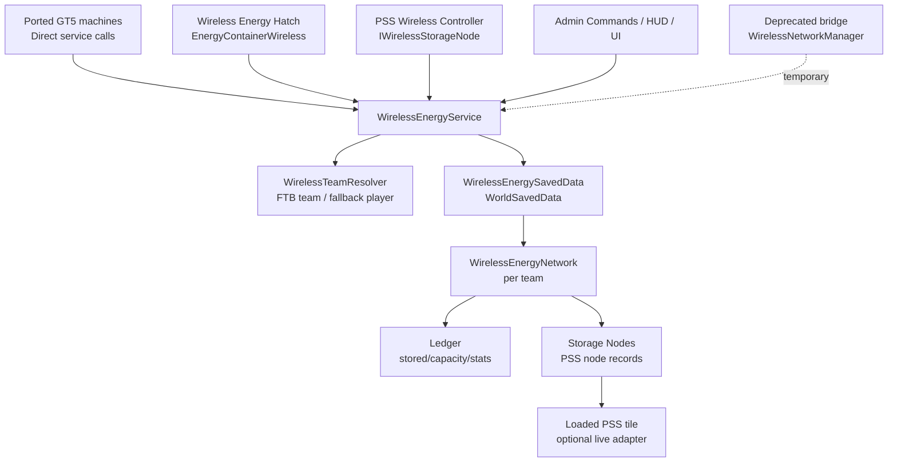

# 无线能量网络比对与最优架构设计

## 目标

本设计比对两个项目的无线能量网络：

- 源端 GT5：`D:\mc\modgit\GT5-Unofficial-master`
- 目标当前项目：`D:\mc\modgit\GregTech`

目标是在当前项目中设计一套统一无线能量架构，为后续 GT5 机器移植提供直接入口，同时利用当前项目已有的 PSS 物理储能网络，避免形成两套互不相通的无线电网。当前项目没有机器直接调用 GT5 式 `WirelessNetworkManager`，因此新移植代码应直接调用统一后的网络服务，不再新增旧全局余额 API 调用点。

## 源端 GT5 结论

GT5 的无线能量网络是“全局账户余额”模型。

核心文件：

- `gregtech.common.misc.WirelessNetworkManager`
- `gregtech.common.misc.GlobalEnergyWorldSavedData`
- `gregtech.common.misc.GlobalVariableStorage`
- `gregtech.api.metatileentity.implementations.MTEWirelessEnergy`
- `tectech.thing.metaTileEntity.hatch.MTEHatchWirelessMulti`
- `tectech.thing.metaTileEntity.hatch.MTEHatchWirelessDynamoMulti`
- `gregtech.common.covers.CoverEnergyWireless`

### 数据模型

GT5 使用：

```text
Map<UUID, BigInteger> GlobalEnergy
```

其中 UUID 会通过 `SpaceProjectManager.getLeader(user_uuid)` 映射到队伍 leader。也就是说，玩家所属队伍共享同一份无线能量余额。

`WirelessNetworkManager.addEUToGlobalEnergyMap(UUID, BigInteger)` 是唯一核心转账入口：

- 正数表示向无线网络存入 EU。
- 负数表示从无线网络取出 EU。
- 操作后余额不能小于 0，否则返回 `false` 且不写入。
- 每次写入会 `GlobalEnergyWorldSavedData.INSTANCE.markDirty()`。

### 持久化

GT5 用 `WorldSavedData` 存储在主世界：

```text
DATA_NAME = GregTech_WirelessEUWorldSavedData
```

旧实现把 `HashMap<UUID, BigInteger>` 通过 Java object serialization 写入 NBT byte array。这个做法方便但不利于版本迁移、排错和跨版本兼容。

### 机器接入

GT5 机器接入方式很直接：

- 无线能源仓每隔 `ticks_between_energy_addition = 100 * 20` tick 从全局余额批量取能，写入自身内部 EU buffer。
- 无线动力仓每隔同样周期把自身 buffer 存入全局余额并清空。
- Cover 无线能量每隔同样周期给目标机器补能。
- 一些大型机器和 addon 机器直接调用 `getUserEU` / `addEUToGlobalEnergyMap`，绕过 hatch buffer。

GT5 的一个重要性能判断是：`BigInteger` 操作比较贵，所以机器端尽量批量转账，而不是每 tick 高频写全局 map。

## 当前项目结论

当前项目有两条路线。

第一条是 GT5 式全局余额，位于：

- `gregtech.common.misc.WirelessNetworkManager`
- `gregtech.common.misc.GlobalEnergyWorldSavedData`
- `gregtech.common.misc.GlobalVariableStorage`

这套已经改成显式 NBT list 存储 `UUID -> BigInteger`，比 GT5 的 Java serialization 更适合维护。但按当前搜索结果，它目前没有业务调用点，基本是遗留兼容层或旧数据迁移源。后续移植 GT5 机器时不应再把它作为主要接入入口。

第二条是 `gtqt` 的 PSS 节点网络，位于：

- `gtqt.api.util.wireless.NetworkDatabase`
- `gtqt.api.util.wireless.NetworkManager`
- `gtqt.api.util.wireless.NetworkNode`
- `gtqt.api.util.wireless.EnergyContainerWireless`
- `gtqt.common.metatileentities.multi.multiblockpart.MetaTileEntityWirelessController`
- `gtqt.common.metatileentities.multi.multiblockpart.MetaTileEntityWirelessEnergyHatch`
- `gregtech.common.metatileentities.multi.electric.MetaTileEntityPowerSubstation`

### PSS 节点网络模型

当前 `gtqt` 设计不是全局余额，而是“无线网络 = 若干个已注册 PSS 控制仓”的集合。

工作方式：

1. PSS 成型后查找 `MultiblockAbility.WIRELESS_CONTROLLER`。
2. `MetaTileEntityWirelessController.sentMTE()` 把自身位置注册到 `NetworkNode`。
3. 无线能源仓的 `EnergyContainerWireless` 每 tick 查找玩家网络。
4. 输入型无线仓从网络 `drain`，输出型无线仓向网络 `fill`。
5. `NetworkNode.fill/drain` 会按 controller priority 遍历已加载的 PSS 控制仓，再调用 PSS 的 `externalFill/externalDrain`。

这个模型的优点是无线能量有物理容量来源，网络容量等于 PSS 储能总量，不是凭空无限账户。

### 当前项目主要差距

| 项目 | 现状 | 风险 |
| --- | --- | --- |
| 两套无线网络 | `gregtech.common.misc.WirelessNetworkManager` 与 `gtqt.api.util.wireless.NetworkManager` 并存 | 如果沿用 GT5 旧调用点，移植机器容易写入全局余额，而当前无线仓读取 PSS 网络，形成能量孤岛。 |
| 网络身份 | 全局余额用 FTB team owner；PSS 网络用 owner 或扫描队伍成员已有 network | 队伍变更、owner 变化和多人访问时容易出现多个 network。 |
| 持久化 | 全局余额存余额；PSS 网络只存 controller 位置 | PSS 未加载时容量和储能不可见，HUD/转账依赖已加载 tile。 |
| 转账性能 | PSS 网络每次 fill/drain 动态解析世界、过滤 loaded hatches、排序 | 高频无线仓越多，查找和排序成本越高。 |
| 统计 | `CPacketRequestNetworkInfo` 请求后调用 `node.resetStats()` | 多个客户端同时看 HUD 会互相清空统计。 |
| 优先级 | tooltip 说等级越高越优先，代码按 `Comparator.comparingInt(priority)` 升序 | 语义可能反了，需要明确高优先还是低优先。 |
| 数据一致性 | PSS tile 是真实储能，NetworkDatabase 是位置索引 | 如果后续要支持未加载节点参与网络，需要解决 tile NBT 与网络账本同步。 |

## 最优架构

推荐采用“统一服务层 + PSS 物理储能账本 + 旧 API 弃用桥接”的架构。

核心判断：

- 当前项目没有机器直接调用 GT5 的全局 BigInteger 账户 API，后续移植应直接接入 `WirelessEnergyService`，不要先移植到旧 `WirelessNetworkManager` 再转发。
- 当前项目的 PSS 物理储能设计更适合长期玩法平衡，容量来自真实多方块，不应退回无限全局余额。
- `WirelessNetworkManager` 可以保留为 `@Deprecated` 桥接层，服务旧存档、命令或临时批量迁移，但不作为新代码入口，也不维护第二套独立余额。

### 总体结构



## 核心模块

### `WirelessEnergyService`

新增唯一服务入口，所有无线能量操作都走这里。

建议 API：

```java
public interface WirelessEnergyService {

    WirelessNetworkView getView(UUID actor);

    TransferResult insert(UUID actor, long amount, TransferContext context);

    TransferResult extract(UUID actor, long amount, TransferContext context);

    TransferResult insert(UUID actor, BigInteger amount, TransferContext context);

    TransferResult extract(UUID actor, BigInteger amount, TransferContext context);

    void registerStorageNode(WirelessStorageNodeSnapshot node);

    void updateStorageNode(WirelessStorageNodeSnapshot node);

    void unregisterStorageNode(WirelessNodeId nodeId, UnregisterMode mode);
}
```

语义要求：

- 所有 extract 必须原子检查余额，不能出现负数。
- 所有 insert 必须检查容量，除非 context 标记为 admin/legacy overflow。
- long 快路径用于每 tick hatch；BigInteger 路径用于 GT5 大型机器、命令和极大数值。
- 服务只在服务端主线程修改数据；如果未来引入异步读取，使用只读 snapshot。

### `WirelessTeamResolver`

统一网络身份解析：

```text
actor UUID -> canonical network UUID
```

当前项目优先使用 FTB team：

1. 如果 FTB Utilities/FTB Lib 存在，使用队伍稳定 id 或 owner UUID。
2. 如果没有队伍，使用玩家 UUID。
3. 如果队伍变更，服务层负责迁移或合并 network，不让业务机器自己扫描队员网络。

GT5 的 `SpaceProjectManager.getLeader` 语义在当前项目中由 `WirelessTeamResolver` 适配；后续移植机器只传 owner/player UUID，不直接关心队伍实现，也不直接调用旧 GT5 全局余额入口。

### `WirelessEnergySavedData`

替换和合并两份数据：

- 当前 `GregTech_WirelessEUWorldSavedData`
- 当前 `gtqt_network_data`

建议新数据名：

```text
GregTech_WirelessEnergyNetworks
```

NBT 使用显式结构，不使用 Java object serialization：

```text
networks: [
  {
    id: "<team-or-player-uuid>",
    name: "Wireless Network",
    stored: byte[],
    capacity: byte[],
    totalInWindow: byte[],
    totalOutWindow: byte[],
    nodes: [
      {
        nodeId: "<uuid>",
        dim: 0,
        x: 0,
        y: 64,
        z: 0,
        priority: 10,
        capacity: byte[],
        stored: byte[],
        status: "ONLINE|OFFLINE|STALE",
        lastSeen: 123456
      }
    ]
  }
]
```

### `WirelessEnergyNetwork`

每个队伍一份 network，内部维护：

- `stored`：网络总储能。
- `capacity`：网络总容量。
- `nodes`：PSS 或其他储能节点快照。
- `stats`：滚动吞吐统计，不允许客户端读取后清零。
- `dirty`：按 tick 合并标记，避免每 tick 多次 `markDirty()`。

关键点：`stored/capacity` 是服务层权威数据，PSS tile 是在线节点的展示和同步端。这样可以让未加载 PSS 节点继续贡献容量和储能，同时避免每次转账都扫世界。

### `WirelessStorageNodeSnapshot`

PSS 成为一种 storage node，而不是 `NetworkNode` 每次转账时动态找 tile。

字段建议：

```text
nodeId
ownerNetworkId
dimension
pos
priority
tier
capacity
stored
maxInputPerTick
maxOutputPerTick
allowExternalAccess
lastSeen
```

PSS 生命周期：

1. PSS 成型并包含无线 controller 时，注册 node。
2. PSS 每 20 tick 或储能变化达到阈值时同步 snapshot。
3. PSS 卸载时写回 snapshot，不注销。
4. PSS 结构失效或 controller 被拆时注销 node。
5. 如果加载后发现位置无效，服务将 node 标记为 `STALE` 并从容量中移除；剩余储能按规则转入 network overflow 或掉落/清零，需要配置决定。

## 能量流设计

### 无线输入仓

当前 `MetaTileEntityWirelessEnergyHatch` 的输入型仓应该：

1. 保持 `EnergyContainerWireless` 作为机器侧 buffer。
2. 每 tick 按 `voltage * amperage` 或配置倍率计算需要量。
3. 调用 `WirelessEnergyService.extract(owner, request, context)`。
4. 成功后写入本地 energy buffer。

### 无线输出仓

输出型仓应该：

1. 从本地 energy buffer 取可发送量。
2. 调用 `WirelessEnergyService.insert(owner, amount, context)`。
3. 只移除实际成功插入的能量。
4. 如果网络满了，本地 buffer 保留能量。

### GT5 机器移植接入

后续移植 GT5 的 EOH、Godforge、LSC、无线 hatch、无线 dynamo、无线 cover 时，应直接调用 `WirelessEnergyService` 或一个薄的领域适配器，例如 `WirelessEnergyAccess`：

```text
WirelessEnergyAccess.insert(owner, amount, context)
WirelessEnergyAccess.extract(owner, amount, context)
WirelessEnergyAccess.getView(owner)
```

旧 GT5 方法名只作为弃用桥接保留：

```java
@Deprecated
gregtech.common.misc.WirelessNetworkManager
```

桥接规则：

```text
addEUToGlobalEnergyMap(uuid, positive) -> service.insert(uuid, amount, LEGACY_BRIDGE)
addEUToGlobalEnergyMap(uuid, negative) -> service.extract(uuid, amount.abs(), LEGACY_BRIDGE)
getUserEU(uuid) -> service.getView(uuid).stored()
setUserEU(uuid, value) -> admin override
```

新移植代码不应新增 `WirelessNetworkManager.*` 调用点。桥接层只用于旧存档迁移、临时批量移植过渡、命令兼容或第三方旧代码兜底。

## 事务与一致性

### 原子转账

所有转账都以 network 为锁或服务端主线程事务为边界：

```text
extract(amount):
  if stored < amount: return failed
  stored -= amount
  stats.out += amount
  markDirtyBatched()
  return success(amount)

insert(amount):
  accepted = min(amount, capacity - stored)
  stored += accepted
  stats.in += accepted
  markDirtyBatched()
  return success(accepted)
```

当 amount 超过 `long`，使用 BigInteger 路径；普通 hatch 保持 long 路径，减少分配。

### PSS 在线同步

服务层是权威余额后，PSS tile 不应该再被每个无线仓直接 `externalFill/externalDrain`。PSS 应通过 node adapter 与 service 同步：

- 在线时，PSS GUI 显示 service 中该 node 的 stored/capacity。
- 如果玩家向 PSS 物理输入仓充电，PSS 调用 service.insertToNode 或 update node delta。
- 如果 PSS 物理输出仓放电，PSS 调用 service.extractFromNode 或 update node delta。

这样无线仓、PSS 本地输入输出、HUD 都读同一套账。

## 性能策略

1. 不在每次无线转账时扫描世界、解析 tile、排序 controller。
2. node priority 使用缓存列表，注册/注销/priority 变化时重建。
3. `WorldSavedData.markDirty()` 合并到每秒或每批事务一次，不在每个 hatch 每 tick 调用。
4. HUD 读取 snapshot，不清空服务统计；统计窗口由服务按 tick 滚动。
5. BigInteger 只用于网络总量、极大机器和持久化；hatch per-tick 量使用 long。
6. 网络查询按 canonical network id 直取，不扫描队伍成员已有 network。

## UI 与同步

### HUD

替换当前“客户端每秒请求并 resetStats”的模式：

- 客户端仍可每秒请求一次。
- 服务返回 `WirelessNetworkView`。
- `WirelessNetworkView` 包含 `stored/capacity/inputPerSecond/outputPerSecond/nodeCount/onlineNodeCount`。
- 读取 view 不改变服务端统计。

### PSS GUI

PSS GUI 应显示：

- 本 PSS node stored/capacity。
- 所属无线网络 stored/capacity。
- 本 node 是否 online、priority、是否允许外部无线访问。
- 当前无线输入/输出速率。

### 管理命令

迁移 GT5 命令能力：

- 查看网络余额。
- 增加/减少/设置余额。
- 查看 node 列表。
- 清理 stale node。
- 合并或迁移队伍网络。

## 与现有代码的落地关系

| 现有类 | 建议处理 |
| --- | --- |
| `gregtech.common.misc.WirelessNetworkManager` | 标记为 deprecated 桥接层，内部委托 `WirelessEnergyService`；新移植机器禁止新增调用。 |
| `gregtech.common.misc.GlobalEnergyWorldSavedData` | 作为旧数据迁移源，迁移后不再作为活跃存储。 |
| `gtqt.api.util.wireless.NetworkDatabase` | 作为旧 PSS node 位置迁移源，迁移后由 `WirelessEnergySavedData` 取代。 |
| `gtqt.api.util.wireless.NetworkNode` | 拆分为 `WirelessEnergyNetwork` 和 `WirelessStorageNodeSnapshot`；不再每次转账动态扫世界。 |
| `gtqt.api.util.wireless.EnergyContainerWireless` | 保留为无线仓 buffer adapter，但改为调用统一 service。 |
| `MetaTileEntityWirelessController` | 从 `IWirelessController` 扩展为 `IWirelessStorageNodeProvider`，负责注册/更新/注销 PSS node。 |
| `MetaTileEntityPowerSubstation` | PSS 能量银行和无线 service 对接，避免无线仓直接操作 PSS tile。 |
| `SPacketWirelessNetworkInfo` / `CPacketRequestNetworkInfo` | 改为同步 `WirelessNetworkView`，不 reset 统计。 |

## 迁移阶段

### P0：冻结语义

任务：

- 明确网络身份规则：FTB team 优先，fallback 玩家 UUID。
- 明确 priority 排序：建议数值越大优先级越高，修正当前升序/tooltip 不一致。
- 明确 PSS 结构失效时 stored 的处理策略：建议失效时从网络容量中移除，并把该 node 的 stored 保留到 PSS tile；如果无法保留则进入 overflow quarantine，等待管理员或恢复节点处理。

验收：

- 写入设计测试用例，不改行为。

### P1：新增统一服务

任务：

- 新增 `WirelessEnergyService`、`WirelessTeamResolver`、`WirelessEnergySavedData`。
- 实现 `insert/extract/getView`。
- 实现显式 NBT 存储 BigInteger。
- 加入迁移读取：从 `GlobalEnergyWorldSavedData` 读旧余额，从 `NetworkDatabase` 读旧 PSS node 位置。

验收：

- 单元测试覆盖正负转账、余额不足、容量不足、BigInteger 大数、NBT 往返。

### P2：接入移植机器统一 API

任务：

- 新增 `WirelessEnergyAccess` 或等价工具，作为移植机器的推荐入口。
- 将后续移植规范写清楚：禁止新增 `WirelessNetworkManager.*` 调用点。
- 将 `gregtech.common.misc.WirelessNetworkManager` 标记为 deprecated，并委托 service 作为临时桥接。
- 保留 `addEUToGlobalEnergyMap/getUserEU/setUserEU/processInitialSettings` 方法签名，仅用于旧代码兜底和迁移期。

验收：

- 新移植机器通过统一 service 存取能量。
- 旧 API 存取能量时实际读写新 service，且代码搜索中没有新增业务调用点。

### P3：接入 PSS 节点

任务：

- `MetaTileEntityWirelessController` 注册 `WirelessStorageNodeSnapshot`。
- PSS 成型、失效、卸载、加载时同步 node。
- `EnergyContainerWireless` 改为 service adapter。
- 删除 `NetworkNode.fill/drain` 中的动态世界扫描路径。

验收：

- 无线输入/输出仓可跨维度访问同一队伍 PSS 网络。
- PSS 卸载后网络 view 仍能显示正确容量和储能。
- PSS 拆除后节点注销且不再提供容量。

### P4：HUD 与命令

任务：

- `SPacketWirelessNetworkInfo` 同步 `WirelessNetworkView`。
- HUD 不再读取后清零统计。
- 添加管理命令和 stale node 清理命令。

验收：

- 多个客户端同时打开 HUD，吞吐统计一致且不会互相清空。

### P5：清理旧实现

任务：

- 标记 `GlobalVariableStorage.GlobalEnergy` 和 `gtqt NetworkDatabase/NetworkNode` 为 deprecated 或删除。
- 保留数据迁移逻辑至少一个版本。
- 写迁移日志，避免玩家存档无线能量丢失。

验收：

- 旧存档加载后，GT5 式余额与 PSS 节点都进入新 service。

## 验证清单

功能验证：

- 单人无队伍：无线输入仓和输出仓读写同一网络。
- FTB 队伍：队员共享同一网络；退队/换队按设计迁移或合并。
- PSS 成型：controller 注册 node，容量进入无线网络。
- PSS 拆除：node 注销，容量移除。
- 多 PSS：按 priority 处理 fill/drain。
- 网络满：输出型无线仓只移除实际插入量。
- 网络空：输入型无线仓不凭空获得能量。
- 迁移入口：新移植机器直接调用 service；deprecated bridge 的 `addEUToGlobalEnergyMap(uuid, -x)` 仍不允许透支。

性能验证：

- 100 个无线仓每 tick 工作时，不发生每次转账全量世界扫描。
- BigInteger 分配集中在 service 层，不在每个 hatch 频繁创建大对象。
- `markDirty()` 被批处理，不随每次转账爆炸增长。

存档验证：

- 旧 `GregTech_WirelessEUWorldSavedData` 能迁移。
- 旧 `gtqt_network_data` node 位置能迁移。
- 存档重进后 stored/capacity/node 状态一致。

## 推荐结论

最优方案不是直接照搬 GT5，也不是保留当前 `gtqt` 节点网络原样。

推荐最终形态是：

```text
移植机器 / 无线仓 / PSS / HUD / 命令
        |
统一 WirelessEnergyService
        |
PSS-backed WirelessEnergySavedData

Deprecated WirelessNetworkManager bridge 仅作临时兜底
```

这样可以同时得到：

- GT5 移植更干净：新机器直接接统一 service，不再复制旧全局余额调用习惯。
- 当前项目玩法更稳：容量来自 PSS 物理结构。
- 数据更可靠：显式 NBT、版本化迁移。
- 性能更可控：服务层批处理、缓存节点、避免每 tick 扫世界。
- 后续扩展更清晰：无线充电、无线 cover、Godforge、EOH、LSC 都只接一个 service。

## 已核对文件

GT5 源端：

- `D:\mc\modgit\GT5-Unofficial-master\src\main\java\gregtech\common\misc\WirelessNetworkManager.java`
- `D:\mc\modgit\GT5-Unofficial-master\src\main\java\gregtech\common\misc\GlobalEnergyWorldSavedData.java`
- `D:\mc\modgit\GT5-Unofficial-master\src\main\java\gregtech\common\misc\GlobalVariableStorage.java`
- `D:\mc\modgit\GT5-Unofficial-master\src\main\java\gregtech\api\metatileentity\implementations\MTEWirelessEnergy.java`
- `D:\mc\modgit\GT5-Unofficial-master\src\main\java\gregtech\common\covers\CoverEnergyWireless.java`
- `D:\mc\modgit\GT5-Unofficial-master\src\main\java\tectech\thing\metaTileEntity\hatch\MTEHatchWirelessMulti.java`
- `D:\mc\modgit\GT5-Unofficial-master\src\main\java\tectech\thing\metaTileEntity\hatch\MTEHatchWirelessDynamoMulti.java`

当前项目：

- `D:\mc\modgit\GregTech\src\main\java\gregtech\common\misc\WirelessNetworkManager.java`
- `D:\mc\modgit\GregTech\src\main\java\gregtech\common\misc\GlobalEnergyWorldSavedData.java`
- `D:\mc\modgit\GregTech\src\main\java\gregtech\common\misc\GlobalVariableStorage.java`
- `D:\mc\modgit\GregTech\src\main\java\gregtech\api\capability\IWirelessController.java`
- `D:\mc\modgit\GregTech\src\main\java\gtqt\api\util\wireless\NetworkDatabase.java`
- `D:\mc\modgit\GregTech\src\main\java\gtqt\api\util\wireless\NetworkManager.java`
- `D:\mc\modgit\GregTech\src\main\java\gtqt\api\util\wireless\NetworkNode.java`
- `D:\mc\modgit\GregTech\src\main\java\gtqt\api\util\wireless\EnergyContainerWireless.java`
- `D:\mc\modgit\GregTech\src\main\java\gtqt\api\util\wireless\ClientWirelessHUD.java`
- `D:\mc\modgit\GregTech\src\main\java\gtqt\common\network\CPacketRequestNetworkInfo.java`
- `D:\mc\modgit\GregTech\src\main\java\gtqt\common\network\SPacketWirelessNetworkInfo.java`
- `D:\mc\modgit\GregTech\src\main\java\gtqt\common\metatileentities\multi\multiblockpart\MetaTileEntityWirelessController.java`
- `D:\mc\modgit\GregTech\src\main\java\gtqt\common\metatileentities\multi\multiblockpart\MetaTileEntityWirelessEnergyHatch.java`
- `D:\mc\modgit\GregTech\src\main\java\gregtech\common\metatileentities\multi\electric\MetaTileEntityPowerSubstation.java`
